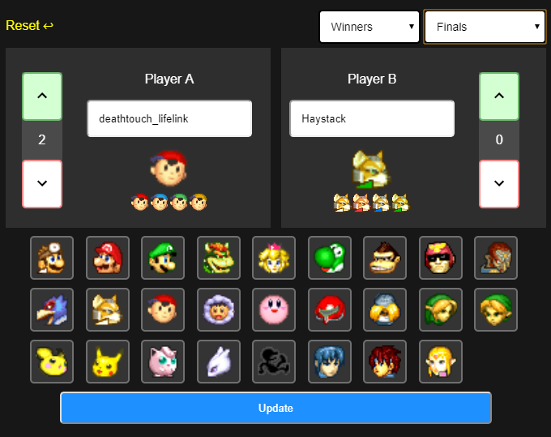

# Peppy
 Melee Scoreboading App

# Purpose
An easy and quick to use app for streamers and TOs to use alongside OBS 

# Roadplan
- Smash.gg integration for easy player Tags
- 4-player mode (For Dubs)
- Port-settings
- Slippi Stats
- Auto score inc via slippi
- Player profile saving (link tag to character&colour)

# How to setup
1. Point the appropriate elements in OBS to:
- /Scores/playerAscore.txt
- /Scores/playerBscore.txt
- /Tags/playerATag.txt
- /Tags/playerBTag.txt
- /Stage/bracketside.txt ('Winners', 'Losers', 'Pools', 'Friendlies')
- /Stage/roundID.txt ('Round 1', 'Round 2' [...] , 'Quarter Finals', 'Finals', 'Grands')
- /icons/inuse.png (Player A icon)
- /icons/insuseB.png (Player B icon)

2. Add attendee tags to ./attendees.txt (one attendee per line)

# How to use
- Select Bracket side, Round
- Type/Search player Tag
- LEFT CLICK icon to set player A
- RIGHT CLICK icon to set player B
- Click colour alts to set colours
- Click "Update"
(note: icons and scores change immediately, tags and bracketside/round need "Update" to be clicked)
- Click "Reset" to reset when new players arrive

